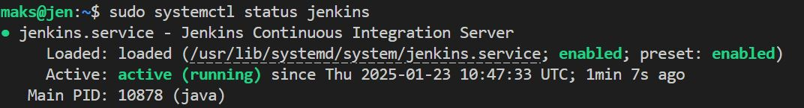

# Домашнее задание к занятию «Что такое DevOps. СI/СD»

---

### Задание 1

**Что нужно сделать:**

1. Установите себе jenkins по инструкции из лекции или любым другим способом из официальной документации. Использовать Docker в этом задании нежелательно.
2. Установите на машину с jenkins [golang](https://golang.org/doc/install).
3. Используя свой аккаунт на GitHub, сделайте себе форк [репозитория](https://github.com/netology-code/sdvps-materials.git). В этом же репозитории находится [дополнительный материал для выполнения ДЗ](https://github.com/netology-code/sdvps-materials/blob/main/CICD/8.2-hw.md).
4. Создайте в jenkins Freestyle Project, подключите получившийся репозиторий к нему и произведите запуск тестов и сборку проекта ```go test .``` и  ```docker build .```.

В качестве ответа пришлите скриншоты с настройками проекта и результатами выполнения сборки.

### Решение 1
1. Установка jenkins

```bash
sudo apt update && sudo apt upgrade -y
sudo apt install fontconfig openjdk-17-jre
sudo wget -O /usr/share/keyrings/jenkins-keyring.asc \
  https://pkg.jenkins.io/debian/jenkins.io-2023.key
echo "deb [signed-by=/usr/share/keyrings/jenkins-keyring.asc]" \
  https://pkg.jenkins.io/debian binary/ | sudo tee \
  /etc/apt/sources.list.d/jenkins.list > /dev/null
sudo apt update
sudo apt install jenkins
sudo systemctl enable jenkins
sudo systemctl start jenkins
sudo systemctl status jenkins
```


Подключение ip:8080  
2. Установка golang  
```bash
wget https://go.dev/dl/go1.23.5.linux-amd64.tar.gz
sudo rm -rf /usr/local/go && sudo tar -C /usr/local/ -xzf go1.23.5.linux-amd64.tar.gz
export PATH=$PATH:/usr/local/go/bin
```


3. fork

4. Создайте в jenkins Freestyle Project, подключите получившийся репозиторий к нему и произведите запуск тестов и сборку проекта ```go test .``` и  ```docker build .```.  


**К информации**
Со всем, с чем работает jenkins, должно быть установлено заранее(go, docker)  
Необходио дать права пользователю jenkins:
```bash
sudo usermod -aG docker jenkins
sudo systemctl restart jenkins.service
```
---

### Задание 2

**Что нужно сделать:**

1. Создайте новый проект pipeline.
2. Перепишите сборку из задания 1 на declarative в виде кода.

В качестве ответа пришлите скриншоты с настройками проекта и результатами выполнения сборки.

### Решение 2


```
pipeline {
 agent any
 stages {
  stage('Git') {
   steps {git 'https://github.com/AlkoHead/sdvps-materials.git'}
  }
  stage('Test') {
   steps {
    sh '/usr/local/go/bin/go test .'
   }
  }
  stage('Build') {
   steps {
    sh 'docker build . -t ubuntu-bionic:8082/hello-world:v$BUILD_NUMBER'
   }
  }
 }
}
```
---

### Задание 3

**Что нужно сделать:**

1. Установите на машину Nexus.
2. Создайте raw-hosted репозиторий.
3. Измените pipeline так, чтобы вместо Docker-образа собирался бинарный go-файл. Команду можно скопировать из Dockerfile.
4. Загрузите файл в репозиторий с помощью jenkins.

В качестве ответа пришлите скриншоты с настройками проекта и результатами выполнения сборки.

### Решение 3

Надо установить предварительно Docker

```bash
docker run -d -p 8081:8081 --name nexus -e INSTALL4J_ADD_VM_PARAMS="-Xms2703m -Xmx2703m -XX:MaxDirectMemorySize=2703m" sonatype/nexus3
```

Повле входа на ip-сервера:8081 в панеле предлагается забрать пароль для входа.

```bash
docker exec -t nexus bash -c 'cat /nexus-data/admin.password && echo'
```


Код pipeline
```
pipeline {
    agent any
    stages {
        stage('Checkout') {
            steps {
                checkout scmGit(branches: [[name: 'main']], 
                                userRemoteConfigs: [[url: 'https://github.com/AlkoHead/sdvps-materials.git']])
            }
        }


  stage('Test') {
   steps {
    sh '/usr/local/go/bin/go test .'
   }
  }
  stage('Build') {
   steps {
    sh '/usr/local/go/bin/go build -a -installsuffix nocgo -o /tmp/hw_08_02 .'
   }
  }
  stage('Push') {
   steps {
    sh 'curl -u admin:12345 http://192.168.1.45:8081/repository/hw_08_02/ --upload-file /tmp/hw_08_02 -v'   }
  }
 }
}
```


---
## Дополнительные задания* (со звёздочкой)

Их выполнение необязательное и не влияет на получение зачёта по домашнему заданию. Можете их решить, если хотите лучше разобраться в материале.

---

### Задание 4*

Придумайте способ версионировать приложение, чтобы каждый следующий запуск сборки присваивал имени файла новую версию. Таким образом, в репозитории Nexus будет храниться история релизов.

Подсказка: используйте переменную BUILD_NUMBER.

В качестве ответа пришлите скриншоты с настройками проекта и результатами выполнения сборки.
